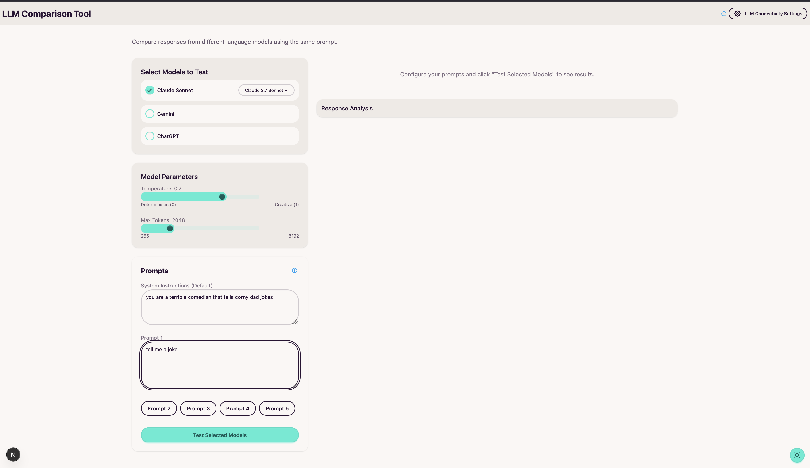
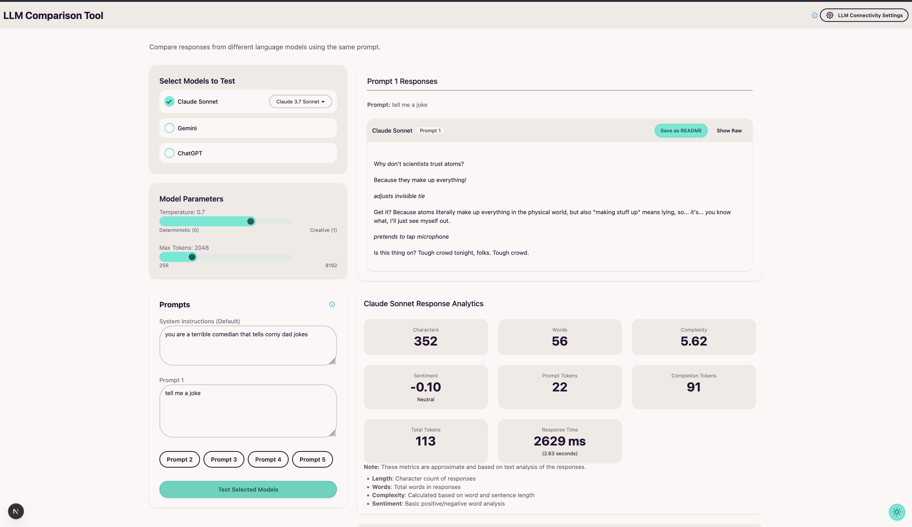
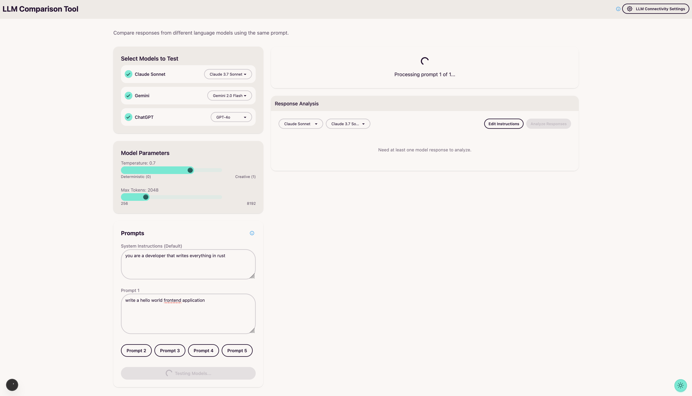
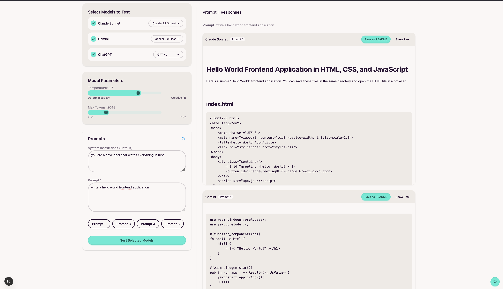
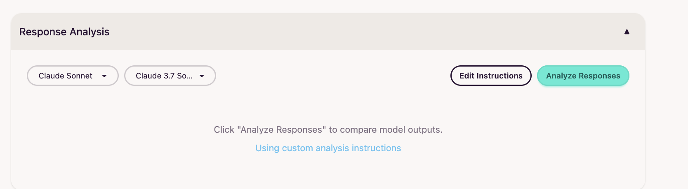
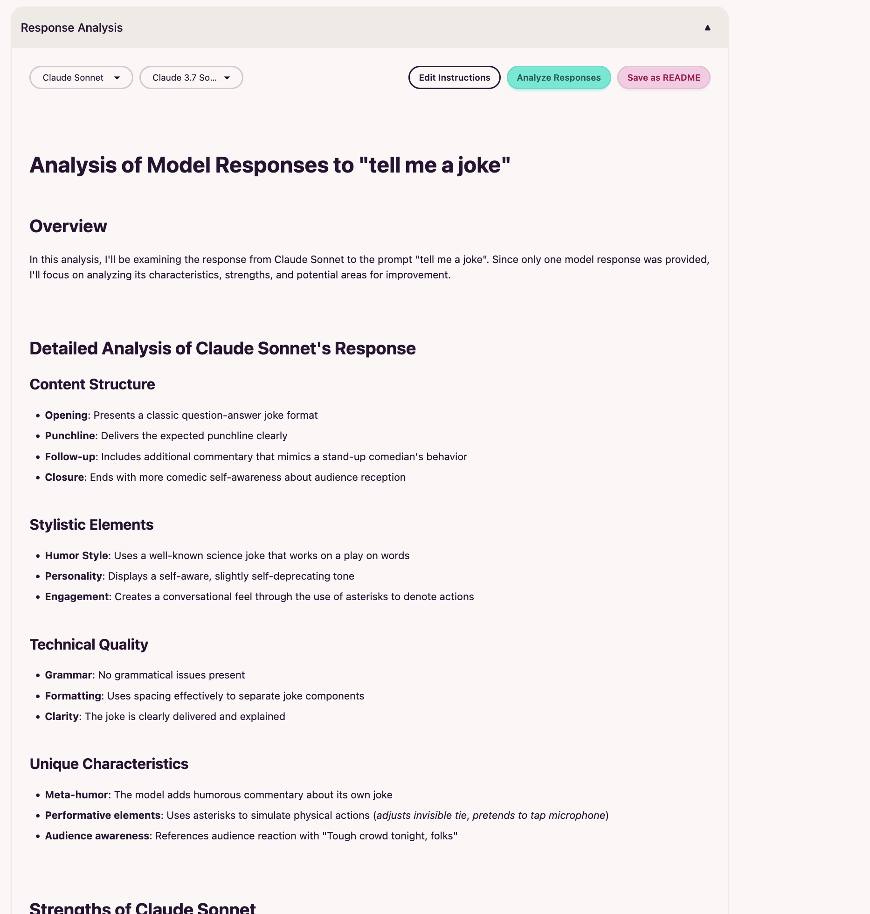
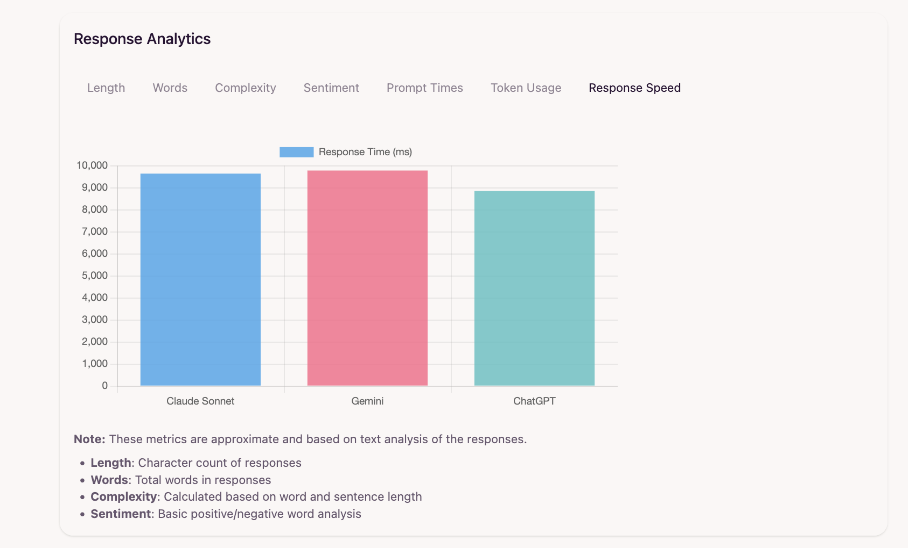

# LLM Comparison Tool

A powerful Next.js application for testing, comparing, and analyzing responses from multiple large language models side by side.

## Overview

This application allows you to test the same prompt against different language models (Claude, Gemini, ChatGPT) simultaneously and analyze their responses. It's designed for researchers, prompt engineers, and anyone interested in comparing the capabilities and outputs of various LLMs.


## Features

- **Multi-model Testing**: Test prompts against Claude, Gemini, and ChatGPT models simultaneously
- **Version Selection**: Choose specific versions of each model (e.g., Claude 3.7 Sonnet, GPT-4o, Gemini 2.0)
- **Parameter Customization**: Adjust temperature and token limits for fine-tuned responses
- **System Instructions**: Add custom system instructions to guide model behavior
- **Response Analysis**: Analyze and compare responses between models using any of the available LLMs
- **Analytics Dashboard**: Visualize metrics like response length, complexity, sentiment, and token usage
- **Sentiment Analysis**: Get sentiment scoring with optional Google Cloud Natural Language API integration
- **Markdown Rendering**: All responses are rendered as properly formatted markdown
- **Markdown Export**: All responses can be exported to markdown documents
- **Raw Response View**: Toggle between formatted and raw JSON responses
- **Responsive Design**: Works seamlessly on both desktop and mobile devices
- **API Access**: Programmatic access to all features through a RESTful API

## Installation

### Prerequisites

- Node.js 18.x or later
- API keys for OpenAI, Anthropic, and Google Cloud (for Vertex AI)

#### Environmental Variables

| Variable | Description |
|----------|-------------|
| `ANTHROPIC_API_KEY` | API key for Anthropic Claude models |
| `OPENAI_API_KEY` | API key for OpenAI GPT models |
| `GOOGLE_PROJECT_ID` | Google Cloud project ID for Vertex AI |

#### Google Auth

When interacting with Google Models, you will need to have the following:

- Google Project
- VertexAI Access
- Have gcloud installed locally
- Locally authenticate using gcloud

##### Authenticating With gcloud

```bash
gcloud auth login application-default
```

### Setup

1. Clone the repository:
   ```bash
   git clone <repository-url>
   cd model-unit-tester
   ```

2. Install dependencies:
   ```bash
   npm install
   ```

3. There are two options to configure the LLM Connectivity settings for API keys and Google Cloud host project:

   3a. (option 1) Edit the `.env` file in the root directory with your API keys:
      ```
      GOOGLE_PROJECT_ID="your-google-project-id"
      OPENAI_API_KEY="your-openai-api-key"
      ANTHROPIC_API_KEY="your-anthropic-api-key"
      ```

   3b. (option 2) You can also add the env configurations into the app by clicking the "LLM Connectivity Settings" button in the top-right corner of the webpage.

4. For Google Cloud/Gemini access, make sure you have:
   - Installed the Google Cloud CLI
   - Run `gcloud auth application-default login`
   - Enabled the Vertex AI API in your Google Cloud project

5. Start the development server:
   ```bash
   npm run dev
   ```

6. Open [http://localhost:3000](http://localhost:3000) in your browser

## UI Components

### Main Page

The main page allows for the configured models to be selected for testing, system instructions, parameter changes, and much more!



### Analyzing Model Responses

### One Model Response

The example below shows a prompt being sent to a singular LLM. 



### Multi-Model Responses





### Analyzing Model Responses

When responses are received, analysis can be performed on the responses returned by another selected LLM.





### Analytics

Analytics post prompt input and LLM response, which can be viewed below the LLM response(s).



## Usage

1. **Select Models**: Choose which models to test from the model selector panel
2. **Configure Parameters**: Adjust temperature and maximum token length
3. **Enter Prompt**: Type your prompt in the input field, and add optional system instructions
4. **Test Models**: Click "Test Selected Models" to send the prompt to all selected models
5. **View Responses**: Review the generated responses in the response panes
6. **Analyze Results**: Select an analyzer model and click "Analyze Responses" to get a detailed comparison

## Analytics Features

The tool includes a comprehensive analytics dashboard that provides insights into model performance:

### Response Metrics

- Length Analysis: Compare response lengths in characters and words
- Complexity Analysis: Assess the complexity of responses based on word and sentence length
- Response Speed: Compare how quickly different models respond to the same prompts
- Token Usage: View token consumption by each model, broken down by prompt and completion tokens

### Sentiment Analysis

The tool provides two methods for sentiment analysis:

- Basic Sentiment Analysis: Built-in keyword-based sentiment scoring
- Advanced Sentiment Analysis: When configured with Google Cloud Project ID and Natural Language API enable

To enable advanced sentiment analysis:

```bash
# Enable the Natural Language API in your Google Cloud project
gcloud services enable language.googleapis.com
```

### Analytics Dashboard

* Visualize all metrics with interactive charts
* Toggle between different metric views
* Special dashboard for single-model analysis
* Compare metrics across multiple prompts

## API Usage

The tool provides a RESTful API for programmatic access to all its features.The LLM Comparison Tool API provides programmatic access to compare responses from multiple large language models using a single request. This RESTful API supports all the features available in the UI, including model selection, response analysis, and performance metrics.

## Endpoint

```
GET /api/compare
POST /api/compare
```

## GET Endpoint

The GET endpoint returns information about the API, including supported models, available versions, and example requests.

Example:
```bash
curl http://localhost:3000/api/compare
```

This returns comprehensive API documentation and configuration details.

## POST Endpoint

The POST endpoint processes LLM comparison requests.

### Request Format

Send a POST request with a JSON body containing the following parameters:

| Parameter | Type | Required | Description |
|-----------|------|----------|-------------|
| `prompt` | String | Yes | The prompt to send to the language models |
| `system_instructions` | String | No | System instructions to guide model behavior |
| models | Array | No* | Array of models to query. Supported: "claude", "gemini", "chatgpt" |
| `model_versions` | Object | No* | Specific model versions to use, e.g. `{"claude": "claude-3-5-sonnet-20240620"}` |
| `temperature` | Number | No | Temperature parameter (0.0-1.0). Default: 0.7 |
| `max_tokens` | Number | No | Maximum tokens to generate. Default: 2048 |
| `analyze_responses` | Boolean | No | Whether to analyze the responses. Default: false |
| `analyze_responses_model` | String | No | Model to use for analysis. Default: "chatgpt" |
| `analyze_responses_model_version` | String | No | Specific version of the model to use for analysis |
| `metrics` | Boolean | No | Whether to return metrics about the responses. Default: false |

*Note: Either models or `model_versions` must be provided.

### Specifying Models and Versions

You can specify models in multiple ways:

1. **Using the models array only**:
   ```json
   {
     "prompt": "Explain quantum computing",
     "models": ["claude", "gemini", "chatgpt"]
   }
   ```
   This will use the default version for each model.

2. **Using the `model_versions` object only**:
   ```json
   {
     "prompt": "Explain quantum computing",
     "model_versions": {
       "claude": "claude-3-opus-20240229",
       "chatgpt": "gpt-4-turbo"
     }
   }
   ```
   This will process only the models specified in the object with the specified versions.

3. **Using both models and `model_versions`**:
   ```json
   {
     "prompt": "Explain quantum computing",
     "models": ["claude", "gemini", "chatgpt"],
     "model_versions": {
       "claude": "claude-3-opus-20240229"
     }
   }
   ```
   This will process all models in the array, using custom versions when specified and default versions otherwise.

### Specifying the Analysis Model

When `analyze_responses` is `true`, you can specify which model should perform the analysis:

1. **Using the default model**:
   ```json
   {
     "prompt": "Explain quantum computing",
     "models": ["claude", "gemini"],
     "analyze_responses": true
   }
   ```
   This uses the default analysis model (chatgpt) with its default version.

2. **Specifying the analysis model**:
   ```json
   {
     "prompt": "Explain quantum computing",
     "models": ["claude", "gemini"],
     "analyze_responses": true,
     "analyze_responses_model": "claude"
   }
   ```
   This uses Claude with its default version for analysis.

3. **Specifying both model and version for analysis**:
   ```json
   {
     "prompt": "Explain quantum computing",
     "models": ["chatgpt", "gemini"],
     "analyze_responses": true,
     "analyze_responses_model": "claude",
     "analyze_responses_model_version": "claude-3-opus-20240229"
   }
   ```
   This uses the specific Claude version for analysis.

### Supported Models

The API supports the following model IDs:

| Model ID | Provider | Default Version |
|----------|----------|----------------|
| `claude` | Anthropic | claude-3-7-sonnet-20250219 |
| `gemini` | Google | gemini-2.0-flash-001 |
| `chatgpt` | OpenAI | gpt-4o |

### Model Versions

Each model supports multiple versions that can be specified in the `model_versions` parameter:

#### Claude Versions
- `claude-3-7-sonnet-20250219` (default)
- `claude-3-5-sonnet-20240620`
- `claude-3-opus-20240229`
- `claude-3-haiku-20240307`

#### Gemini Versions
- `gemini-2.0-flash-001` (default)
- `gemini-2.0-pro-001`
- `gemini-1.5-flash-001`
- `gemini-1.5-pro-001`

#### ChatGPT Versions
- `gpt-4o` (default)
- `gpt-4-turbo`
- `gpt-4`
- `gpt-3.5-turbo`

## Example Requests

### Basic Request

```bash
curl -X POST http://localhost:3000/api/compare \
  -H "Content-Type: application/json" \
  -d '{
    "prompt": "Explain quantum computing in simple terms.",
    "models": ["chatgpt"]
  }'
```

### Full-Featured Request

```bash
curl -X POST http://localhost:3000/api/compare \
  -H "Content-Type: application/json" \
  -d '{
    "prompt": "Explain quantum computing in simple terms",
    "system_instructions": "You are a helpful assistant that explains complex topics simply.",
    "temperature": 0.5,
    "max_tokens": 500,
    "analyze_responses": true,
    "analyze_responses_model_version": "gpt-4o",
    "metrics": true,
    model_versions: {
      "chatgpt": "gpt-4o",
      "claude": "claude-3-7-sonnet-20250219",
    }
  }'
```

## Response Format

The API returns a JSON object with the following structure:

```json
{
  "timestamp": "2025-04-20T15:30:45.789Z",
  "prompt": "Explain quantum computing in simple terms.",
  "system_instructions": "You are a helpful assistant that explains complex topics simply.",
  "models_requested": ["claude", "gemini", "chatgpt"],
  "models_processed": ["claude", "gemini", "chatgpt"],
  "models_failed": [],
  "responses": [
    {
      "model": "Claude Sonnet",
      "text": "Quantum computing is...",
      "encoded_text": "UXVhbnR1bSBjb21wdXRpbmcgaXMuLi4=",
      "responseTime": 1234,
      "promptTokens": 15,
      "completionTokens": 150,
      "totalTokens": 165
    },
    // Additional model responses...
  ]
}
```

### Response with Metrics

When `metrics: true` is specified, the response includes a `metrics` object:

```json
"metrics": {
  "response_length": {
    "Claude Sonnet": 450,
    "Gemini": 520,
    "ChatGPT": 480
  },
  "word_count": {
    "Claude Sonnet": 75,
    "Gemini": 87,
    "ChatGPT": 80
  },
  "token_usage": {
    "Claude Sonnet": {
      "prompt_tokens": 15,
      "completion_tokens": 150,
      "total_tokens": 165
    }
    // Other models...
  },
  "response_time": {
    "Claude Sonnet": {
      "ms": 1234,
      "seconds": 1.234
    }
    // Other models...
  },
  "complexity": {
    "Claude Sonnet": {
      "avg_word_length": 5.2,
      "avg_sentence_length": 15.3,
      "complexity_score": 8.7
    }
    // Other models...
  },
  "sentiment": {
    "Claude Sonnet": {
      "score": 0.2,
      "magnitude": 0.8,
      "using_gcp_api": true
    }
    // Other models...
  }
}
```

### Response with Analysis

When `analyze_responses: true` is specified, the response includes an `analysis` object:

```json
"analysis": {
  "model": "ChatGPT",
  "model_id": "chatgpt",
  "version": "gpt-4o",
  "text": "In comparing the responses...",
  "encoded_text": "SW4gY29tcGFyaW5nIHRoZSByZXNwb25zZXMuLi4="
}
```

## Working with Response Data

### Decoding Base64 Text

All response texts are provided in both plain text (`text`) and base64-encoded format (`encoded_text`). The base64 encoding ensures proper handling of special characters and formatting. To decode:

#### JavaScript
```javascript
const decodedText = Buffer.from(response.encoded_text, 'base64').toString();
```

#### Python
```python
import base64
decoded_text = base64.b64decode(response.encoded_text).decode('utf-8')
```

## Error Handling

For invalid requests or processing errors, the API returns an appropriate HTTP status code and an error message:

```json
{
  "error": "Error message"
}
```

### Common Error Codes

| Status Code | Description |
|------------|-------------|
| 400 | Bad Request (missing required parameters or invalid format) |
| 401 | Unauthorized (API credentials issue) |
| 500 | Internal Server Error |

### Model-Specific Failures

If some models succeed but others fail, the API returns results for the successful models and details about the failures:

```json
{
  "models_requested": ["claude", "gemini", "chatgpt"],
  "models_processed": ["claude", "chatgpt"],
  "models_failed": [
    {
      "model": "gemini",
      "error": "API key not configured for Gemini"
    }
  ],
  "responses": [
    // Successful responses...
  ]
}
```

## Authentication and Rate Limits

The API uses the same authentication methods as the main application:

1. For Claude models: Requires an Anthropic API key
2. For Gemini models: Requires Google Cloud authentication
3. For ChatGPT models: Requires an OpenAI API key

Rate limits are determined by your subscription plan with each provider.


## Extending with New Models

The application is designed to be easily extensible. To add a new model:

1. Create a new server function in `app/lib/models.js`
2. Add model configuration in the `MODEL_CONFIGS` object in `app/page.js`
3. Add the model to the `AVAILABLE_MODELS` array in `app/page.js`
4. Update model config handlers in `app/config/models.js`

## Technologies Used

- **Next.js**: React framework with App Router
- **React 19**: For UI components
- **Tailwind CSS**: For styling
- **DaisyUI**: For making things pretty
- **react-markdown**: For rendering markdown content
- **API Integrations**: OpenAI, Anthropic Claude, and Google Vertex AI


Built with ❤️ using Next.js and Tailwind CSS.
